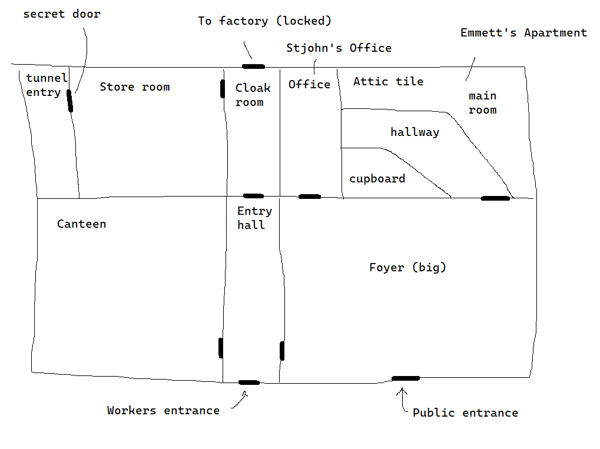
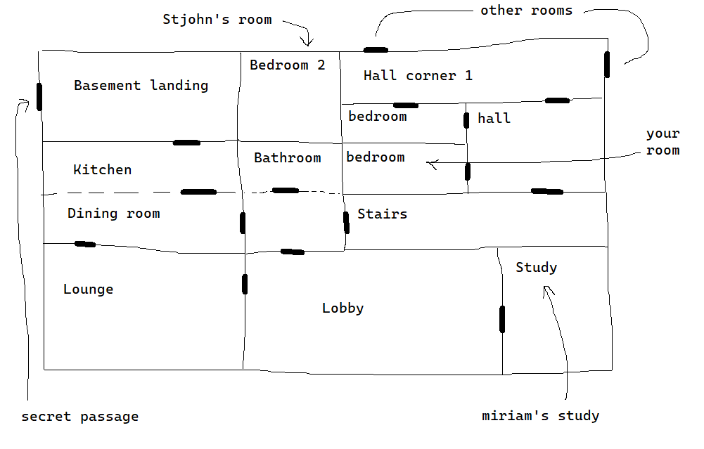
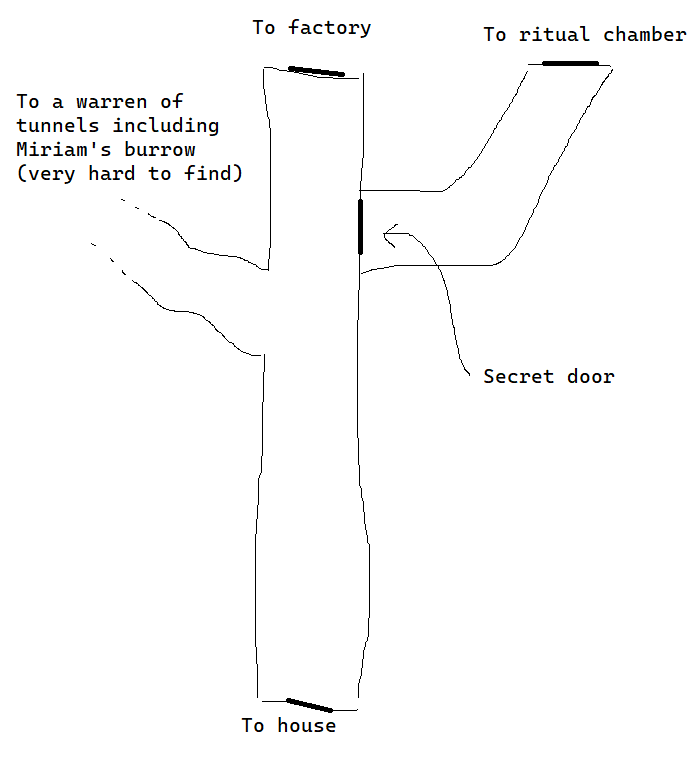

+++
title = "Hercule Poirot's Machine for Pigs"
date = "2021-12-23"
template = "poirot.html"
+++

    <h1>
    Hercule Poirot's  
    MACHINE FOR PIGS
    </h1>

This is a scenario for [_Call of Cthulhu_][coc] or similar systems. It is a
loose parody of [_Hercule Poirot's Christmas_][hpc] and [_Amnesia: A Machine for
Pigs_][mfp], though it is mainly about the midlanders' insatiable lust for pork.

Despite the name, it can be played with any set of investigators.

> ⚠️ **Warning:** Any references to real entities, history or geography are
> likely to be wildly inaccurate or misleading. In particular the stuff
> featuring Egyptian history wants going over to make it better informed and to
> avoid the sort of Orientalism you tend to find in works such as this,
> assembled from tropes and wikipedia. These materials are my notes from running
> the scenario precisely once and have not been substantially edited; they are
> provided as-is.

# Premise

You, a prominent investigator and/or writer, have been staying at one of the
colleges at Oxford University on professional business over the Christmas
holiday. You receieve summons to the country estate of Stjohn Cavendish, wealthy
owner of a pork pie factory, who fears for his life...

# Contents

<!-- toc -->

# Character List

## Investigators

See below.

## Cavendish household

**Stjohn Cavendish**, financier & industrialist

**Miriam Cavendish**, his wife, American, archaeologist, deceased.

**Geoffrey 'Jeffers' Butler**, manservant

**Gertrude White**, housekeeper

**Stjohn Cavendish Jnr**, a Tory MP

**Anne Cavendish**, his wife

**Reginald Cavendish**, a gambler

**Emily Cavendish**, an adventurer

**Barry Lovegood**, her partner, a magician

## Cavendish Works

**Recalcitrance Emmett**, an engineer

# Background

## Timeline

- **1500BC**, A cannibal cult of pig-worshippers construct an underground
temple complex near Cairo, Egypt. For 1000 years their activities
feed the Entity. The cult is suppressed by various powers, from
the Ptolemies to the Romans, though it persists.

-   646, Cult all but eradicated during Islamic conquest when Egypt is
    wrested from the Eastern Roman Empire.

-   1842, Mineworkers exposed to the Dudley Barrow Tablet, infected by
    the Hunger.

-   1886, Recalcitrance Emmett born into the afflicted community

-   1924, Miriam returned from expedition

-   1925, Emmett Works Co. contracted to build the Cavendish Works.

-   1926, Miriam discovers translation tablet, publishes paper on the
    subject

-   1926, Miriam receives anonymous letters warning her not to publish
    further and to desists from her work.

-   1927, Cavendish Works completed

-   1927, Miriam succumbs to the Hunger and is hanged - or so it
    seems...

-   1927, Cavendish Works opens

## Beneath the City of the Dead

-   Pigs actually a substitute for cannibalism, and their sacrifice
    intended to ward off an entity that possesses the minds of its
    victims and hungers for human flesh

-   Cult suppressed following the Islamic conquest in 646AD and their
    tunnels were sealed and built over. Yet rumour had it that the
    hunger persisted in anyone who spoke their accursed language or
    read their texts, which were systematically destroyed.

-   The entity can possess you if you read its words and understand
    them. Its presence can also emanate a short distance from the
    objects in which its essence is trapped.

-   The practice of cannibalism creates a bridge to the entity and
    allows it to manifest itself and imprint itself on the cannibals.
    This is why its cults manifest in disparate locations.

## The Dudley Barrow

-   A tablet in a script similar to that found in the City of the Dead
    was found in a barrow near Dudley which was disturbed by early
    surface coal mining. The script was badly damaged, yet
    translations in Old English and Latin were better preserved. The
    tablet was found by locals who found themselves being slowly but
    surely transformed. They face a daily increasing lust for flesh
    which can only be temporarily sated through consumption of pork
    products. Eventually they will be overcome with the desire to
    consume their fellow men.

-   The great engineer Recalcitrance Emmett, secretly one of their
    number, seeks a solution. To begin with he settles on the idea of
    limitless pork. He offers to build a factory for Stjohn at a
    knockdown price...

## The Statue

The statue depicts a man and a woman with the heads of bigs, bearing a
chalice from either side. Stjohn keeps it in the dining room in pride of
place, it being a gift from Miriam. Other residents of the house hate
it; they swear they feel a strange uneasiness around it - but that could
be due to what happened with Miriam... Some say that since it appeared
in the dining room, meat would disappear from their plates when they
weren't looking ... and that everything now tastes like pork. Stjohn
swears this is simply because the cook refuses to cook anything else, it
being in such plentiful supply.

The statue is the key which was used to lock the Entity in its pocket
dimension, fashioned by the pig cult of Cairo shortly before their
demise. It was to be their salvation, yet they only managed a single
turn of the lock, leaving the Entity partially trapped. With enough
sacrifice, the lock could be fully closed -- or fully opened. The
presence of the Entity emanates from the key - wherever the key goes,
the door is present too.

When blood is poured into the chalice, it vanishes, consumed by the
Entity. With enough blood, the Entity can be made sluggish and the key
can be turned. Yet feeding the Entity is incredibly dangerous; it is
momentarily strengthened, and complex rituals are needed to keep it in
check. The tunnels under Cairo followed this design - as does the
Factory.

# The Investigators

Feel free to substitute a different set of investigators. The only
real requirement is that they be prominent detectives or investigators
of strange events. We used the following; you would need to make your
own character sheets for them.

## Agatha Crane

Parapsychologist and paranormal investigator, from [Mansions of Madness 2nd Edition][mom2e].

On sabbatical at the University of Oxford, writing a book on the
paranormal.

## Wilbur Crane

Her husband, see [Mansions of Madness 2nd Edition][mom2e].

## Hercule Poirot

[Famous detective.][poirot]

Skeptical of the paranormal, as it does not gel with his orderly and
rational view of the world, but respects use of the scientific method.

## Miss Lemon

[His secretary.][lemon]

Fascinated by the occult.

## Inspector Japp

The [only policeman in the entire country][japp]. Some say there are 
multiple copies of him. Will likely arrive if the police become 
involved.

# Characters

## Miriam Cavendish

Archaeologist from Boston, Massatchusetts.

In 1924, Miriam Cavendish returned from an archaeological expedition
beneath the City of the Dead in Cairo, Egypt. The dig had found an
extensive network of subterranean tunnels, deeper and more ancient than
the Islamic necropolis above. Among the artifacts recovered, some of the
most fascinating were the reliefs of pigs and pig-headed people -
previously the pig was not thought to be held in such reverence by the
ancient Egyptians. More curious still, several human skeletons appeared
to have been combined in mummification with those of pigs. Miriam
brought back with her a small statue along with several stone tablets
covered in indecipherable text.

Miriam's dig was funded by the new American University at Cairo, which
was seeking to raise its profile by making an archeological discovery.
The initial discovery was made when a tomb floor collapsed in the city
of the dead, revealing a much older network of tunnels which had been
bricked up some time around 600AD. Some, particularly a group of
scholars from al-azhar university, were not keen on a dig going ahead,
argueing that the tunnels should remain sealed. But modernisers won out
and the exploration went ahead.

### Return to Egypt

Miriam presented Stjohn with the statue as a gift, and he proudly
displayed it in the dining room, where it sits to this day. She obsessed
over the stone tablets, travelling back and forth to the dig at Cairo,
and consulting experts in obscure and dead languages. When a later
tablet was discovered, containing text in both the mysterious script and
Arabic, she at last appeared to be making progress.

### Descent into Madness

Those around her became alarmed by her behaviour; she was becoming more
and more obsessive and withdrawn. She began to refuse vegetables and
would eat only meat. One night, Miriam killed and butchered a
maidservant with the aid of two other servants - who later claimed to
have no memory of the incident (having been mesmerised by Miriam.) They
fed the meat into the meat grinding apparatus of the newly opened
factory, making pies from the resulting mince and consuming them. Having
done this, they returned to their beds covered in gore. The human
remains were quickly discovered by factory workers and the perpetrators,
including Miriam, were arrested and hanged, the evidence against them
all being incontrovertible.

The families of the victim and of the two accomplices blame the
Cavendishes and their accursed works for what happened - the works was
never popular owing to the commercial threat it posed to traditional pie
making. And the workers are from out of town and keep to themselves.

### In Hiding

Miriam is not dead and actually faked her death: she mesmerised the
guards at the prison and took the place of the executioner. He lived
alone, and as far as anyone was concerned he was still there going about
his business. Miriam started a fire in the morgue where 'her' body was
stored, and so nobody was able to identify her subsequently. As the
executioner, she had a steady supply of human remains on which to feed,
and additionally stalked the city of Leicester at night via the sewers.

### Return

Shortly before the game begins a guard is reported missing - this is
because Miriam has returned to the Cavendish estate to perform the
ritual to free the Entity. She is now completely mad and wants revenge
on Stjohn for reporting her to the authorities.

She is hiding out in the tunnels beneath the factory. A couple of
workers have gone missing - she has killed them and is eating them.

She wants her notes from her study, which is why she has been breaking
into the house. Eventually, she will find that what she needs is the
idol, in order to release the Hunger from its prison. But Recalcitrance
will already have stolen it!

### Current state

Miriam is a ghoul who knows the Mesmerise spell.

## Stjohn Cavendish

Wealthy man who made his fortune trading futures contracts using capital
bequeathed to him by his uncle. After many years of success, including during
the war, through a clerical error he came into posession of a large number of
'pork futures' which came due almost immediately. When life gives you pork, make
pork pies; he is now a big name in the meat pie business and the pie works is
his most profitable asset.

He is an amateur Egyptologist; he met his late wife Miriam at a lecture at the
Natural History Museum. He financed her expeditions after she was cut off by
Miskatonic University.

No 'mythos' knowledge as such; he does not understand the significance of
anything he might have gleaned. But has a keen interest in antiquities and
has a sharp mind.

Stjohn thinks he has seen the ghost of Miriam haunting the house at
night. Locks have been found smashed, but nothing taken. The police
found no other evidence of burglary. He doesn't know what to believe,
but fears for his safety - could it be the families of the servants sent
to the gallows exacting their revenge? He has therefore sent for the
best detective and the best paranormal investigator to find out.

## Geoffery 'Jeffers' Butler

- Longstanding member of the household
- Has his fingers in the till
  - If you inspect his records, you find some odd purchases (accounting)
  - If confronted he will admit they were fake and that he took the money
    (persuade/intimidate)
- No interest in Miriam's work
- Thought the statue had 'bad vibes'.

## Gertrude White

- The cook
- Make something up!

## Stjohn Cavendish Jnr

A tory MP

- Eldest son of Stjohn Cavendish. Miriam wanted him named after his
  father in the American fashion.
- Managed to get out of fighting in the war pleading ill health; he
  got his father to make a substantial donation to a relevant official.
- Supports the idea of a surprise attack on France and will not shut
  up about it -- "it's the last thing they will expect!"
- Relies on an allowance for income and wishes there was more
- Alcoholic

## Anne Cavendish

- Wife of Junior
- Brains of the operation; manages political career
- née Bucket
- Quarrels with Stjohn Snr over his Liberal leanings
- Immaculate appearance
- Womens Institute
- Wants allowance raised

## Reginald Cavendish

- Gambler
- Opium smoker "it's for the old leg you know"
- Went to pieces after his mothers death and spends his time gambling
- Formerly a financier like his father
- Might he steal to fund his gambling and opium? He has stolen jewelery from
  Emily in the past.
- A captain in the war, decorated for bravery, shrapnel wound in leg

## Emily Cavendish

- Adventurer
- Ran away to join the circus and travel the world. Spent time in
  Alexandria and Cairo. Speaks Latin, Greek and Arabic. Handy with
  a revolver.
- Rescued Barry from assailants in Damascus
- Was attempting to investigate her mother's work in Egypt in order
  to understand her disappearance but had to leave after the authorities
  got wind of it.
- Tried to contact institutions of her mothers Egyptian contacts, they seem to
  know something but dont let on.
- Was a fortune teller and medium in the circus. Doesn't believe in
  it though.

## Barry Lovegood

- A magician and diamond geezer
- The family disapprove of him and will not allow him in the house
- He visits in secret anyway
- Escapology expert
- Met Emily whilst travelling in the Orient.
- Speaks Arabic very badly
- Private in the war.

## Recalcitrance Emmett

Recalcitrance offered to build a pork works for Stjohn at a knockdown
price, and brings with him those of his people worst affected by the
Hunger, so as to look after them.

He has followed Miriam's recent career with interest, and combs over it
for hints of the rituals they used to subdue the entity - recognising
that the ancient Egyptians were affected by the same Hunger as his
fellows. The Factory is constructed as a great ritual device, following
the pattern of the site at Cairo.

He warned Miriam anonymously not to publish the text of the tablet but
this spurred her on - she took it to be a deception from a rival.

He has seen the tablet in the Dudley Barrow, being a scion of the pork
cult there - but his people know by now not to read it. Since it is
damaged, it is also less dangerous than the Cairo tablet.

Recalcitrance is running the factory as part of a ritual to contain the
hunger, and wants to seal it away forever. He has made copies of
Miriam's notes, and knows he needs the idol to complete the ritual.

His workers live in a nearby village called 'Domesday'. The village
predates the works but its population has been doubled by the influx of
workers. They live in a complex of barracks buildings reminiscent of a
boarding house, and they are treated with some distrust by the locals.
Their standard of living is spartan and their pay is low yet they are
curiously loyal to Recalcitrance. They are directly employed by his
company, the Emmett Works Co., which was contracted to build and run the
factory. This arrangement results in a lot of value for money for
Stjohn, so Recalcitrance's eccentricities are tolerated.

> 💡 **Note:** Whilst he is not actually a villain he is supposed to be a
> suspicious character and draw the attention of the investigators. He
> is prickly, secretive and unhelpful.

# Locations

## Oxford

Agatha and Wilbur are staying in one of the colleges at Oxford
university.

## The Factory

The factory is built in the Egyptian Revival art deco style. It was
built on the former site of a chapel on the Cavendish Estate, and has
its own shuttle line to the railway station.

The factory was designed and built by the Emmett Works Co. on behalf of
Stjohn Cavendish, who wanted to consolidate his presence in the pork pie
industry. Animals and materials are delivered by train; the animals are
slaughtered on site and then processed immediately into pies and pork
products.

> 💡 **Note:** This map uses [Mansions of Madness 2nd Edition][mom2e] tiles, but
> this isn't necessary.

## The House

An old stately home on a country estate.

All the usual Cluedo rooms.

> 💡 **Note:** This map uses [Mansions of Madness 2nd Edition][mom2e] tiles, but
> this isn't necessary.

## The Tunnel

Tunnel from the house to the factory.

The secret door should be very hard to find and almost impossible to open
unless you have found Emmett's journal which explains it and the ritual.

## The Ritual Chamber

Secret tunnels accessible from the main tunnel but hidden. Secret
ritual chamber.

The appearance is the same as that of the lower chamber described in
Miriam's journal since it follows the same design. Drains from the
factory above flow into ducts which bring blood to a central point.

This is where the statue needs to go in order to perform the ritual
of banishment.

If you have the spell and the statue and get here, Miriam will
attack! You must race to complete the ritual whilst fending her
off and resisting the influence of the Entity.

## The Deep Tunnels

Warren of tunnels off the main tunnel. Entrance not obvious. Hard
to navigate -- like potholing. Ghoul burrow is somewhere off here
but should be very hard to find; the 'intended' showdown with Miriam
is during the ritual to banish the entity.

## Domesday

Village where the workers' barracks is located.

## Melton Mowbray

Town famous for its pies.

## Melton Mowbray Police Station

The cop shop in Melton Mowbray. This is where Emmett (or anyone else arrested)
will be taken.

## The Prison

Prison near leicester where Miriam was supposedly hanged. The investigaters
may choose to go here and look around.

> 💡 **Note:** We didn't go here.

# Plot

## Oxford, Morning, 22nd December, 1933

Perhaps the investigators are doing their Christmas shopping before returning to
their lodgings.

This is a chance to flesh out why they are here and what they are like.

On your return, you find the central heating is broken (or perhaps there is a
water leak.) It cannot be repaired before Christmas! Drat! Soon after, the phone
rings. It is Geoffrey Butler, the butler to Stjohn Cavendish. His master has
heard of you, and insists you join him at his estate for Christmas -- he fears
for his life and has need of your expertise. He suspects the danger to be
supernatural in nature.

Prepare to travel to the estate and arrange travel.

## Train to Leicester, Morning, 23rd December, 1933

Get the train to Melton Mowbray. Change at Leicester.

The train races through countryside that is blanketed in thick snow, though the
sun is shining and the sky is clear.

Arrive in Melton Mowbray around 1PM, to be met by Butler in a car. Any other
investigaters who arrived in a different way will also be here. Butler drives
you all to the _factory office_ of Stjohn Cavendish.

## Cavendish Works, Afternoon, 23rd December, 1933

You are dropped at the entrance.

> 💡 Describe the factory. It's an imposing building in the Egyptian Revival
> art deco style, with ornate collonades and reliefs and statues of pigs.

The door is open and you can talk to the receptionist. Most of the factory
is off limits.

You are ushered upstairs to Stjohn's office. It is an ornately furnished
room, full of contemporary furniture and Egyptian antiquities. Stjohn sits
behind a large walnut desk, and gestures for you to sit. He explains his
concerns:

- The tragic death of his wife some years ago
- The recent break-in
- How he was sure he saw the figure of his late wife standing over
  him during an incident of sleep paralysis, as well as glimpses
  roaming the halls at night

You can press him on the circumstances of her death. He will tell you
what he knows.

> **Handout:** Newspaper covering Miriam's death

- He is suspicious that the victims' families might be enacting their
  revenge on him, but he can't shake the feeling that he has actually
  seen a ghost.
- If you ask about the factory, he will tell you about Recalcitrance (who is at
  work in the factory right now) and his ingenious construction and surly
  temperament. How the style is a result of his and Miriam's shared love of
  ancient Egypt.
- Trouble with the local pie makers
- You can ask for a tour, but most of the factory is off limits right now
  because it is working and therefore not safe

If you attempt to leave the foyer the receptionist will attempt to stop
you and summon stout lads if you persist.

The apartment upstairs (where Recalcitrance lives) is marked as off
limits and is locked.

When you are done, Butler will collect you and take you to the house.

## Cavendish House, Afternoon-Evening, 23rd December, 1933

Jeffers conveys you to the Cavendish House, which is a large Georgian
manor house. Dinner will be served at 7pm. Where has Wilbur got to?
Poirot goes off to his room.

Agatha can go to her room and unpack her stuff and talk to Wilbur. She
might sneakily have a look round or make preparations, but she does not
have long.

### Dinner

At 7pm the dinner gong sounds; everyone should proceed to the dining
room.

Place all the family and guests in the dining room. Recalcitrance is
present for this - but Barry is hiding in Emily's room. Agatha and
Poirot can ask questions over dinner, and characters will chime in with
conversation points pertinent to themselves.

Eventually, somebody notices that Stjohn's prize statue is missing! He
is furious, and after much kerfuffle requests Agatha and Poirot search
the house. Someone e.g. Junior remarks that everyone hated that damned
thing anyway. **Recalcitrance has stolen it and hidden it in his
apartment, which he did via the tunnels.**

Can search the house and interview suspects

#### Points of interest

-   Miriam's study. Locked. Where is the key?

    -   In Stjohn's room, in the side table drawer.

-   Talk to staff

-   Talk to family

-   Barry is hiding in Emily's room.

-   Entrance to the tunnels in the basement **VERY hard to find**.

-   Recalcitrance stays with Stjohn in the drawing room.

### Night

After the search is complete, everyone goes to bed. At midnight, you are
awoken by a bloodcurdling scream!

The scream came from Stjohn's room. You should probably investigate! He
comes running out, half dressed, shouting 'Miriam!'. When he calms down,
he explains he awoke in a state of paralysis and saw Miriam standing
over him, her face angry and deathly pale. He managed to scream, at
which point she vanished. There is no trace of a presence anywhere - but
Miriam's office has been ransacked! Nothing has actually been taken
though.

Junior suspects the locals.

Reginald is hysterical and pours himself a large drink.

Emily thinks it was all in his head.

You should probably check the doors etc and then return to bed. Perhaps
it was all in his head?

## Morning, 24th December, 1933

Agatha can decide what to investigate and where to go:

-   The locals in the village

-   The workers at Domesday and the Factory

-   The Prison where Miriam was held and executed

-   Interview the family about last night

That evening at dinner, there are some suspicious absences.... Emmett is
at work too.

## Cavendish House, Midnight, 24th December 1933

The murder!

You are again awoken by a scream. (Assuming you went to bed - if you lay
in wait, then perhaps you were mesmerised by Miriam, or you heard the
scream from elsewhere.)

This time the scream is cut short by a sickening gurgle and a loud
crash, a bestial shriek, animalistic snarling, and the sounds of
frenetic violence being done. The noises come from the foyer.

In the foyer is Stjohn's mangled body. There is blood everywhere. On the
walls there is blood. On the ceiling, blood. His head has been pulled
from his body and the rest of him has been torn to pieces. He is covered
in blood. On examination you can see that great bloody chunks seemingly
have been bitten from him. On <u>close</u> examination (a good
roll) you can see that this was the work of a human jaw but with canine
teeth. Bloody footprints lead away from the body towards the wine
cellar. Elsewhere in the house, Miriam's study has again been ransacked.
Notebooks are scattered prominently - unless you found them before.

On the floor of the wine cellar is the silver key. This unlocks the
secret door to the tunnels - which you might have located already via a
good spot hidden roll, or you might need to search for it. This time
there is a trail of blood leading to a wall so it should be easier to
find.

If you follow, you can enter the tunnels. The tunnels run from the house
to the factory. The silver keys works at this end too. The deep tunnels
are behind another secret door down there; its unlikely you will find it
without a good light source and time to look around. This is where
Miriam has dug her burrow.

If you follow the tunnel you will end up in the factory, which throws
some suspicion on Emmett! This is how he stole the statue. You might
want to interrogate him and search his apartment. Someone should have
called the police - you might do this with Inspector Japp if you wait
long enough.

In Emmett's apartment, you might find

-   The Statue (well-hidden, in a safe behind a painting)

-   Copies of Miriam's notes, in his desk

-   Copies of correspondence with Miriam where he sought to warn her off

-   His diary, in code, hidden with the statue

He does *not* yet know about Miriam - he believes the Hunger is what
caused her to go mad, but he doesn't know she survived. The evidence
against him is probably strong enough for Japp to arrest him and take
the statue as evidence.

## Cavendish House, Morning, 25th December 1933

Christmas! Walter and Agatha exchange gifts. Perhaps she bought one for
Poirot too!

What do you do next?

Tonight Miriam will assault the police station to get the statue (or
Emmett's apartment if it is still there.)

## Remainder

At this point all the pieces should be in place, either you find Miriam
and seal away the hunger or you will be hunted down and killed. Or you
can run away and everyone at the house will die.

# Emmett's Journal

Make a handout

- Factory/ritual based on Miriam's notes
  - Location of secret door to tunnels if not already found
  - Location of secret door to ritual chamber from tunnels +
    how to open it e.g. a lever or key
- _Contain the Hunger_ spell
- Community of those afflicted by the Dudley tablet

# Miriam's Journal

Found in Emmett's Desk.  In cryptic shorthand.  Each handout takes
some time to decipher from the journal.  It should not be possible
for the investigators to obtain all of the information too early, 
but they should be able to get it all by the time they need it, so
adjust the difficulty based on when the journal is found.

> 💡 **Note:** There is perhaps too much material here and it might be
> best to cut it down.

> **Handout: 1925-26, Day 48**
>
> Day 48 of the dig. We have already learned so much, yet we have barely
> scratched the surface!  And I mean this quite precisely. Yesterday, we
> discovered a vertical shaft, about 100 feet in diameter. A ramp would have
> originally spiralled down, yet the woodwork has long since decayed. I will need
> to secure additional funds in order to further plumb the depths, yet I cannot
> resist the lure of the unknown -- tomorrow, I will descend the shaft on a rope,
> using a winch powered by our diesel engine. The shaft descends almost to the
> extent of our longest rope, but we are in luck; I can just about make it. I will
> make what explorations and sketches as I can before my electric torch is
> exhausted and then return to finish our work on the upper level. 
> 
> Speaking of which, I already have enough material for at least two papers,
> perhaps more. From the objects and remains that we found, we can determine some
> of the nature of the society that left them along with a little of their
> history. The tunnel complex stems from before Roman or Ptolemaic rule, and it
> would seem what lies below is even older. The religion being practised here
> seems of a type with ancient Egyptian religions, such as we know of them, though
> the fixation on the pig is unusual -- absent are the sorts of animal typically
> venerated by the ancients. Disturbingly, from human remains we have examined, it
> is clear that these people at one point or another practised cannibalism --
> human bite marks and signs of cooking are evident on some of the bones. The
> remains were not simply cast aside, but were found arranged in a sort of
> ossuary, curiously intermixed with those of swine, perhaps as part of some
> religious practice.
>
> Amongst the objects scattered in the tunnels, of particular note are a small
> statue which depicts a man and a woman with the heads of pigs, bearing a
> chalice from either side, and several stone tablets covered in the
> indecipherable glyphs of an unknown language. 
> 
> From an examination of the masonry at the entrance, and of human remains found
> on the upper level -- which bear the traces of violence done with weapons, and
> some of which possess curiously canine teeth -- we have determined that the cult
> was put to the sword and consigned to oblivion during the Islamic conquest of
> Egypt in the 7th century. I hope that tomorrow's survey of the depths will
> provide further insight.

> **Handout: Day 49**
>
> **Entry 1**
>
> Blast and damnation! Those gutless fools at the University have informed us
> that we have to stop our work at once! The site must be sealed immediately and
> no-one is to be allowed access. I am to attend a meetring this afternoon, where
> I intend to demand an explanation for this outrage! I have sequestered the
> statue I found, along with the best preserved of the cryptic stone tablets, with
> my luggage -- my work with those, at least, will continue.
>
> **Entry 2**
>
> Met with the Dean of my institution, along with two individuals claiming to be
> members of a secret society of scholars at Al-Azhar University. They say that
> they are guardians of of secret knowledge passed down from hundreds of years ago
> when the university was a centre of philosophical learning under the Fatimid
> Caliphate. When the vast library of the university was burned by Saladin, they
> preserved certain arcane manuscripts which were deemed too precious -- or too
> dangerous -- to be lost. Among these is a journal dating to the 7th century,
> which speaks of an underground cult of pig-eaters, whose excesses had developed
> into cannibalism, and whose language would afflict the reader or speaker with an
> insatiable hunger. They were put to the sword by brave men who blindfolded
> themselves and sealed their ears with wax so as not to be swayed by the cult's
> devilish whisperings. Neverthless, the legends tell of those who heard the
> eldritch words of that accursed tongue, or who attempted translations of it, who
> found themselves cursed. The strongest of these sealed themselves in stone
> chambers, there to perish, lest they give in to what they called 'the hunger'.
> Those who did not do so were consumed by it, and stories tell of the 'ghouls'
> who roam at night and feast on the flesh of the dead.
> 
> Clearly, this is no more than a lurid superstition, and I will argue most
> stridently for the re-opening of the site! For now, I will return to England,
> consult experts on languages, and work on my papers.

> **Handout: 2 Months Later**
>
> Gave a lecture today at the British Museum with my preliminary findings,
> trying to drum up interest. Made quite a stir! Am in constant correspondance
> with the University, trying to get them to find their nerve, and things
> appear to be moving in our favour! I pulled a few strings at the foreign
> office and the secret scholars have been arrested for sedition; it 
> looks like we will be able to go ahead.

> **Handout: 1 week later**
>
> Have received an anonymous letter titled 'beware the translations!' They are
> attempting to throw me off! Either this is one ofo the remaining secret scholars
> who slipped the net, or one of my rivals has found out about them and is
> attempting the same thing! No matter, I will continue! I must return to Egypt.

> **Handout: 1 month later**
>
> Egypt. We have re-opened the dig site. Things are as we left them thanks to the
> guards we posted at the entrance. We will continue our survey -- I have secured
> a grant from my alma mater Miskatonic University and have used it to purchase
> the supplies and labour necessary to expand our operation beyond the bottom of
> the great shaft. We have electric light and power, winches and climbing gear.
> Tomorrow, I make the initial descent.

> **Handout: next day**
>
> Numerous tunnels head off from the shaft at different levels. Of these, I
> have explored two, both of which were small chambers of unclear function. Another
> tunnel had collapsed, being blocked by fallen masonry. At the very bottom of the
> shaft, I made a most marvellous find -- a grand entrance flanked by pig-headed
> statues. Through this doorway, I entered what appeared to be a vast sacrificial chamber,
> containing a stone altar and channels in the floor leading to a series of drains -- evoking
> the Roman practice of augury. Beneath this chamber, accessed via a stairway, is another
> chamber of similar size, with ducts leading to a central pedestal -- perhaps a
> place for the priest or sacred receptacle to receive the blood from above.  On
> my way back through the shaft, I made what could be my most significant find. An
> _intact_ stone tablet, containing Arabic and Coptic inscriptions in addition to
> the strange language we have encountered elsewhere. I enclose sketches of the
> temple layout. (These are enclosed).

Note: if you know the factory plans you can see it follows the same layout
as the sacrificial chamber

> **Handout: 2 months later, England**
>
> I have left the dig in the capable hands of my team, and have returned to
> England bearing the new tablet. The Arabic text was translated for me thus:
>
>     This is the home of the people
>     who are delivered from their hunger
>     by the flesh of swine
>     long may these words be its prison
>
> the tablet appears to be a multilingual sign that would have been displayed
> at the entrance. Its message is rather banal -- though on reading the words
> I must admit a stirring within me -- but a comparison between the arabic, 
> the coptic and the original text should allow us to unlock other secrets
> as did the Rosetta stone for ancient Egyptian. I will redouble my efforts
> with the original tablets armed with new knowledge.

> **Handout: December 1926, England**
>
> As I unlock the secrets of the tablets, I have become certain that the
> warnings of the scholars, which I had dismissed as so much foolishness, were
> terrifyingly correct. Each night I am wracked by dreams of bloody slaughter, and
> each day I draw no nourishment from food save for meat. I dare not spend time
> amongst other people lest I lose control; I am confined now to my study. My one
> glimmer of hope is in the continuing translation of the tablets -- the ancients
> were afflicted with this same hunger, yet they had developed techniques and
> rituals with which to suppress it. These measures eventually failed, but they
> bought considerable time. And the tablets hint at a great ritual to imprison the
> hunger forever, using their language itself as its prison...

> **Handout: May 1927**
>
> I feel a great clarify in my mind -- how foolish and ignorant I was before!
> Such sights have I beheld in my dreams...
>
> (the remainder is nonsense, until...) <!-- TODO: Make the below a made up language. -->
>
> 𓀀 𓀁	𓀂 𓀃	𓀄	𓀅	𓀆	𓀇	𓀈	𓀉	𓀊	𓀋	𓀌	𓀍
>
> (A series of unintelligible signs in an unknown language. You feel
> hunger stirring within you. **1/d3 horror.**)

# Spells

## Mesmerise

This is _Dominate_ from the CoC rulebook.

Opposed POW roll.

Miriam controls your actions. She has to look into your eyes in order to
initiate but from then on the link is psychic. Must recast each round.

## Contain the Hunger

This is _Dismiss Deity_ from the CoC rulebook.

The Hunger has POW300, so 12MP is necessary to open the way.

Cost: 1MP per participant
Casting time: 1 round per participant

Hunger can attempt Mesmerise whilst being dismissed.

Each further MP sacrificed increases dismissal chance by 5%.

# Adversaries

## Miriam

Ghoul with _Mesmerise_.

Could be accompanied by other ghouls or have stats buffed as needed.

She can mesmerise any number of people so she could be assisted by
mind-controlled humans.

## The Entity

Use stats for something big e.g. Yog Sothoth. But it can't physically
manifest. It will try to control you during the ritual so you must
resist its POW.

[mom2e]: https://www.fantasyflightgames.com/en/products/mansions-of-madness-second-edition/
[poirot]: https://www.agathachristie.com/en/characters/hercule-poirot#about
[lemon]: https://en.wikipedia.org/wiki/Hercule_Poirot#Miss_Felicity_Lemon
[japp]: https://en.wikipedia.org/wiki/Hercule_Poirot#Chief_Inspector_James_Harold_Japp
[hpc]: https://en.wikipedia.org/wiki/Hercule_Poirot%27s_Christmas
[mfp]: https://store.steampowered.com/app/239200/Amnesia_A_Machine_for_Pigs/
[coc]: https://www.chaosium.com/call-of-cthulhu-rpg/