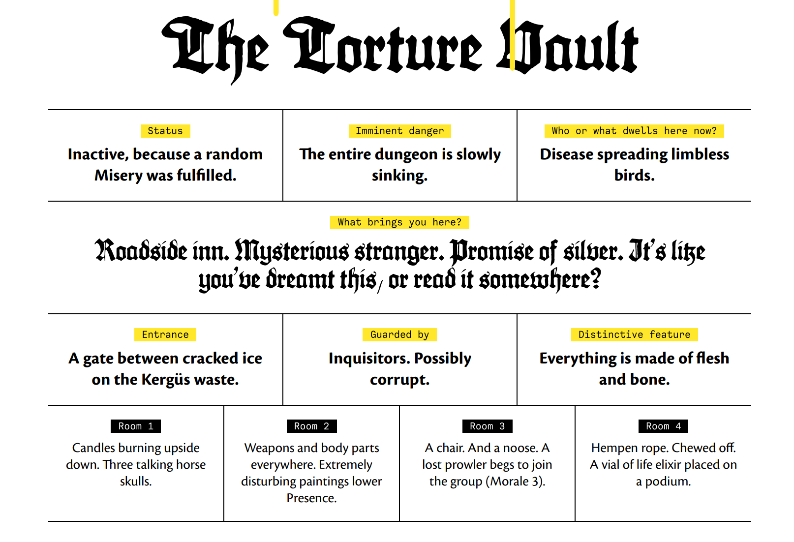
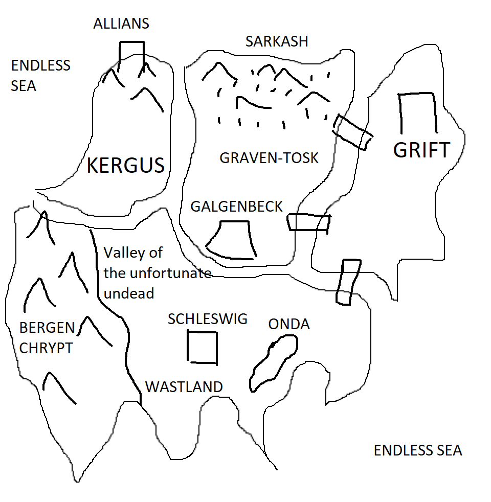
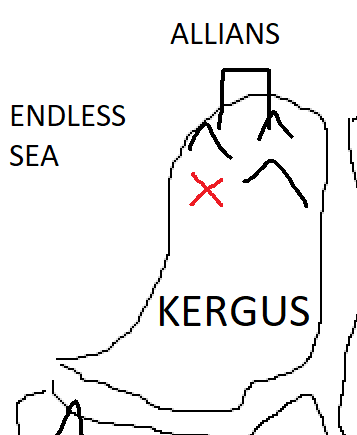
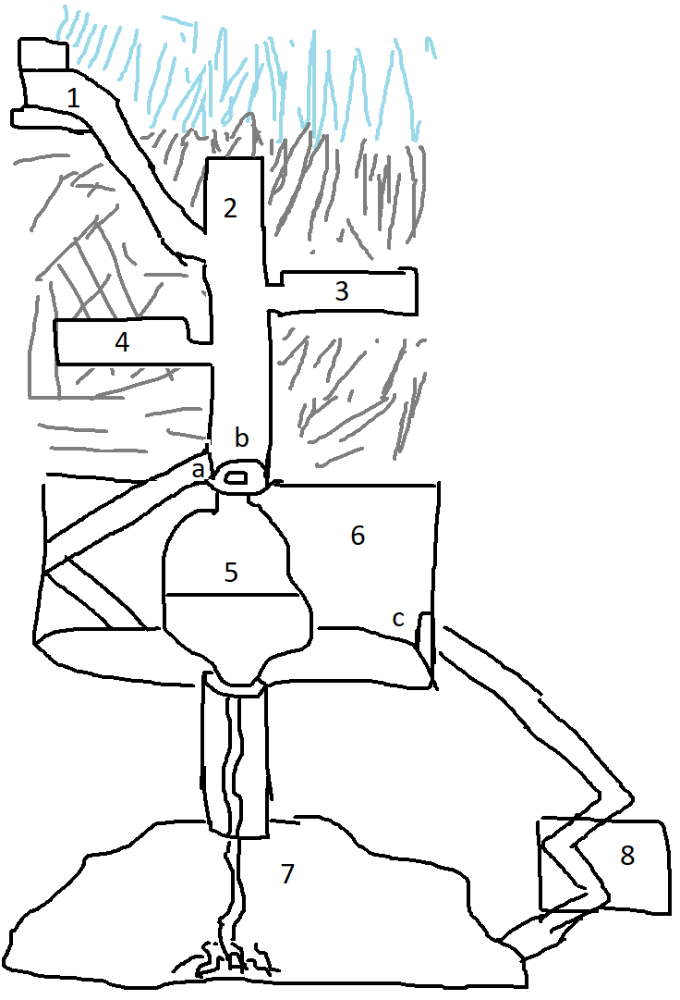

+++
title = "MÖRK BORG Quick Start"
date = "2023-01-19"
template = "morkborg.html"
+++

This is a simple introductory scenario I made for [MÖRK BORG][morkborg] based on
output from the fabulous [dngngen][dngngen].

##  Prerequisites 

-   Character sheets

-   Rules reference

-   Set of dice: d20, d10, 2d6, d4

-   Pencils

-   Paper

##  The world 

The world is ending as prophesied by the two-headed basilisks.

##  The end of the world 

The world will end after seven miseries have befallen it. Roll 2d6 to determine the first misery.

##  You 

Create a character. Either pick a premade one, or [roll a new one.][scvmbirther]

###  Where are you? 

After several days travel into the mountains of the Kergus wastes, you approach
the ice-blue wall of a glacier, its frozen ramparts bearing down from the gloomy
sky. A thunderclap rolls along the valley and a sheet of ice calves off,
crashing down into the shallow meltwater below. As the ice settles, silence
returns. Ahead, protruding from the water like a shipwreck at low tide, at the
foot of the glacier, you see a plinth of cyclopean masonry emerging from the
ice.

- Kergüs is a desolate icy expanse
- To the north is the obsidian citadel Alliáns, wherein resides the
  Blood-Countess Anthelia

###  Why are you here? 

-   You heard a rumour?

    -   Whilst travelling, you happen upon an old man with one eye, one
        ear, one arm, one finger, one leg and one toe. He tells you
        that on the advent of the first misery, a sealed vault in the
        icy wastes of Kergus was opened...

-   You were hired?

    -   Immediately following the first misery, you are summoned from
        the dungeons beneath the obsidian citadel of Allians. The
        steward of the Blood Countess offers you freedom. In exchange,
        you will plumb the depths of an ancient vault which has opened
        inside a glacier...

-   You had a dream?

    -   On the night of the first misery, your sleep is disturbed by
        terrible visions. Walls of flesh and bone beneath the ice,
        monstrous and limbless birds that spread terrible plagues. You
        find yourself compelled to walk into the mountains...

-   You read about it?

    -   Whilst studying in the archives of the obsidian citadel, you
        happen across mention of an ancient vault beneath a glacier.
        You head off in search of riches.

##  The entrance 

A massive stonework plinth emerges from the shallow lake of meltwater at
the foot of the glacier. You know this marks the entrance. Ice
occasionally falls from the glacier and hits the plinth below. Water
runs off it in streams.

Getting to the top of the plinth will require climbing up from the
bottom - or down from atop the glacier.

###  The Inquisitors 

-   Atop the plinth is a camp. On PRESENCE DR10 you notice smoke from
    the campfire.

-   The camp belongs to D3+1 Inquisitors.

    -   Inquisitors seek out and punish heresy against
        the church of the Two-Headed Basilisks.

    -   The Inquisitors wear masks and robes, and under
        their robes is armour.

    -   Stats and weapon as Berserker but without the Special.

-   The camp contains equipment and items

    -   D4 random items

    -   An oil lamp

    -   Several torches

    -   Flint and tinder

-   The Inquisitors claim to be guarding the site from
    heretics. Heretics such as **YOU!**. To the side of the camp lie the bodies
    of previously encountered heretics. They have been staked to the ground,
    their chests split open, and their lungs removed.

    -   If approached, the Inquisitors will be hostile
        and attempt to kill you.

    -   It might be possible (very difficult) to convince them
        otherwise.

-   The Inquisitors are really after the treasure.

-   During the day, they will be attempting to get into the vault.

##  The Gateway 

At the centre of the plinth is a massive stone gateway. The gateway is sealed by
an overgrowth of pulsating flesh and teeth, but the Inquisitors have been at it with tools. Perhaps there is a
knack to it? Or maybe brute strength will get you through.

Once you open the gate, more ice breaks off the glacier and the plinth cracks.
You feel the earth tremble beneath you and you are thrown to the ground. (Test
AGILITY to avoid damage.) When you regain your feet, the ground beneath you has
dropped several feet and is noticeably sloping. Water streams down the stairs,
mixing with the gore from the fleshburg. This place won't last long!

##  The Dungeon 

###  0. Collapse 

Every 6 times you move between rooms, roll d6. On a 1, the earth shakes.
The dungeon sinks deeper into the earth. Cracks appear in the walls and
the torrent of water from above grows stronger. The 3rd time this
happens, the entrance collapses and you are sealed inside.

###  1. Staircase 

You enter the maw. A stream of meltwater, viscera and black bile flows
into darkness and the walls are pulsating fleshy matter studded with
nubs of bone; eventually stone steps become solid granite hewn from the
bedrock as you descend.

The staircase is regular; the water does not pool unless obstructed by
fleshy outgrowths. Your way is occasionally impeded by smaller
fleshburgs and mucous membranes which can be overcome by brute force. As
you do so, the walls pulsate furiously. Risk of tripping on the slick,
uneven floor. There is no source of light other than that which you
bring.

###  2. The Upper Shaft 

You emerge into a larger space. This is a shaft about 20m in diameter --
your light source might not reach all the way to the other side. The
torrent flowing down the staircase sluices out over the edge of a
walkway that curves to the left along the wall of the shaft, and which
descends in as another staircase, all cut into the rock.

If you inspect the walls, you see that there are oil lamps embedded in
sconces in the wall. You could light them if you wish. This is true of
all the subsequent rooms; larger rooms have braziers.

The walls of the shaft are thick with the fleshy growths. At the bottom
of the staircase, a long way down, is a circular sphincter that leads to
the digestion chamber. The floor slopes down into the centre of the
room. Water coming down from above flows down into the sphincter.

If you fall from above, you fall down into the digestion chamber.

At the bottom of the shaft, there is a locked door which leads to a long
staircase.

###  3. The Bone Chapel 

The approach to this room is dark. Upon entering it, however, rows of
upside-down candles burst into flame, illuminating a shadowy nave and
vaulted ceilings in the distance above. There are pews to either side of
the nave, made of polished bone. At the end of the nave is an altar,
upon which lie 3 horse skulls.

As you approach the horse skulls they glow with a sickly green light.
You hear the galloping and screaming of three ghostly stallions. The
skulls float into the air and approach you. They speak to you, offering
assistance in exchange for a portion of your soul. If you accept, roll
d6 on the table for the souls merchant. They vanish, and a silver key
appears on the altar. If you refuse, they vanish, and the bone pews
reassemble themselves into d6 skeletal warriors! If you beat them, a
silver key appears on the altar.

The silver key unlocks the door at the bottom of the Upper Shaft.

###  4. The Armoury 

This room seems to have escaped the worst of the creeping flesh growth.
A vial of life elixir sits on a pedestal in the middle of the room.
Racks of rusty weapons and armour line the walls. At the far side of the
room is a chest containing d6 items.

In here is one of the plaguebearing snakebirds. It is roosting on the
ceiling. You can spot it with a PRESENCE check DR12. If you approach the
pedestal, it flies down to attack you.


* On receiving damage roll d10. On a 1, become INFECTED. Your 
  skin is covered in weeping sores; take d2 damage per day.


###  5. The Digestion Chamber 

An organic sac which hangs in a larger stone chamber. The sac is filled
with acid and half-digested flesh. It can be cut.


* You cannot dodge stomach acid. This only affects you if 
  you are inside the stomach.
+ The digestion chamber takes 6x damage from inside.



###  6. The Torture Vault 

Hundreds of dormant snakebirds roost on the ceiling. If you attack the
digestion chamber, d4 snakebirds wake up and attack you.

The floor of the room is lined with skulls and bones. Skulls are piled
against the wall, which are lined with disturbing paintings and
instruments of torture. Some of these could be usable weapons. Presence
is lowered by 1.

A hole in the middle of this room leads to a sump where the blood of the
sacrifices was pooled. This is depicted in the paintings on the walls,
which show people being dismembered, disembowelled, exsanguinated etc,
in this room.Work is performed by the slaves of the snakebirds, in their
honour. The slaves eventually either share the same fate, or are
depicted covered in sores and pustules and are thrown into the sump.

Where there is furniture, it is typically made from polished bone. This
includes the picture frames.

The digestion chamber is in the centre of the room -- you may or may not
have slashed your way out. Great cords flesh and veins spiral round it
and lead up to the shaft.

The digestion chamber blocks the stairs leading down to the lower shaft.

###  6.1 Return to the Torture Vault 

If you enter the Torture Vault after the Fleshgod has been killed, you
hear a roaring from below. A tide of gore erupts into the Vault. D3+1
fleshy tendrils sprout from the walls and floor. The gore vortex scours
the room, and you are thrown to the ground; snakebirds are torn from the
ceiling and eviscerated in mid-air. The rusted instruments of torture
around the room are swept up in the vortex, and a great armoured serpent
of flesh and bone is formed in the middle of the room. The Fleshgod is
back!

 
* If the fleshgod hits you, test AGILITY DR14. If 
  you fail, you are DEVOURED and end up in its stomach
** You cannot dodge stomach acid. This only affects 
   you if you are inside the stomach.

You can cut your way out of his stomach (STRENGTH DR10). 
This does 4x damage and his armour is negated.



-


When the fleshgod is finally killed, the earth shakes some more. This
place is collapsing! You need to run back to the surface. As you ascend,
rooms collapse behind you, and the flow of water from above intensifies.
It's difficult to make progress. It's possible you will need to swim to
the surface.

###  7. The Sump 

A drain from the torture vault leads to the sump, a subeterranean lake
where the bodies and fluids of the snakebirds victims ended up. The
great mass of flesh has achieved sentience and has been growing up
through the dungeon trying to escape.

The lower shaft leading down to the sump is really a drain. It has a
ladder which leads most of the way down, but at the end you will need to
drop. There is water at the bottom.

When you land in the sump the water immediately starts to bubble around
you. The piles of bones and gore and fleshy extrusions around you
combine into the many-armed FLESHGOD, his giant snake-form bristling
with skeletal arms and his face a grinning skull.

 
* The flesh god pummels you with its many arms; it 
  makes 3 attacks per round.
+ If the cables connecting the fleshgod have been 
  severed, the fleshgod’s health is 15.


When the fleshgod is killed, the earth shakes and a passageway opens
leading up to the treasure room.

###  8. The Treasure Room 

D4+1 chests. 1 chest is cursed. 1 chest contains an item from the
tenebrous reliquary. The rest contain random loot.

Stairs from the treasure room lead back up to the torture vault.

##  Appendix 

##  Rules 

See [reference][rules]

[morkborg]: https://morkborg.com/
[rules]: https://drive.google.com/file/d/1372heBerUrMiDONWURthu7kyVClOEdTv/view?usp=sharing
[dngngen]: https://dngngen.makedatanotlore.dev/
[scvmbirther]: https://scvmbirther.makedatanotlore.dev/