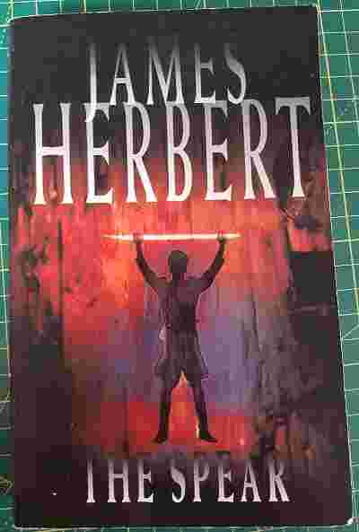

+++
title = "The Spear"
date = "2023-04-12"
sorted_by = "date"
[taxonomies]
tags=["cursed", "books"]
contexts=[]
categories=[]
+++

published 1978

£1.99, oxfam

verdict: mostly good supernatural thriller but also very cursed

the good
- car chase where a mini is pursued by a chieftain tank possessed by the ghost
of Heinrich Himmler
- final boss is zombie (you guessed it) Heinrich Himmler complete with little
  spectacles (they do fall off) aided and abetted by MI5 and elements of the US
  military
- zombie's head explodes when shot, both removing the head _and_ destroying the
  brain as per the proper procedure

the bad
- sustained and very nasty weapons-grade transphobia rears its head toward the
  end of the book (there's more to be said on violence and misogyny in this book
  but this particularly stuck out!)
- the villain has a prosthetic nose so you know he's evil

the weird
- each chapter begins with an epigraph by Adolf Hitler, Heinrich Himmler,
  Richard Wagner or similar, weaving in the story of
  [Parsifal](https://en.wikipedia.org/wiki/Parsifal) and the Nazis appreciation
  of it.
- elements of the deep state in thrall to a nazi cult are behind the IRA, the
  Baader-Meinhof group, the Japanese Red Army, industrial militancy in the
  united kingdom (which is in the same category), as well as Palestinian
  resistance in a bid to discredit the left and take over the world, in a sort
  of proto-QAnon conspiracy

misc
- protagonist is of the same alcoholic loner template used in the other two
  James Herbert books I have read, this time a former arms dealer who used to
  work for Mossad, who epitomise a sort of action-hero ethic of righteous
  violence meted out against a dehumanised enemy. at the start of the book he
  is disillusioned with the cycle of violence and revenge and has quit to work
  as a PI. but by the end we're perpetrating hate crimes and machine-gunning
  nazis so theres a bit of having-your-cake-and-eating-it going on. it's a very
  violent book and perhaps a bit fascist itself.