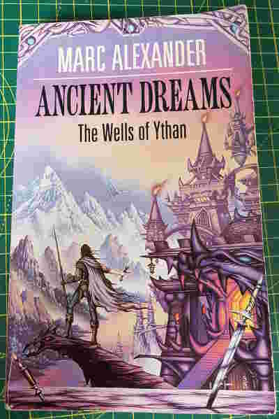

+++
title = "Ancient Dreams"
date = "2023-04-17"
sorted_by = "date"
[taxonomies]
tags=["books"]
contexts=[]
categories=[]
+++

published 1988

verdict: an enjoyable slice of generic fantasy, some weirdness, nicely written,
i will read the sequels

- there is quite a lot of surprisingly enjoyable writing, especially e.g.
  descriptions of wooden houses & clockwork toys.
- compelling section in a boat along a haunted river, exploring ancient ruins,
  finding lost villages... and then hundreds of miles traversed 'off screen'
  because we need to finish the book & we're back in the city of nonces
- (i will flesh this out!)