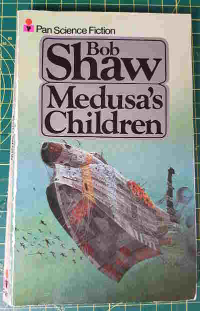

+++
title = "Medusas's Children"
date = "2023-04-17"
sorted_by = "date"
[taxonomies]
tags=["books"]
contexts=[]
categories=[]
+++

published 1977

verdict: good!

- just what one is looking for in an old paperback scifi book.
- descendents of a ships crew are marooned in a sphere of water in space, eking
  out an existence in the extreme conditions.
- this happened because of global warming causing sea levels to rise. people
  used wormholes to suck the extra water into space. some people got sucked in
  by accident.
- I think the name refers to the raft of the medusa? Can't remember if this is
  mentioned in the text.