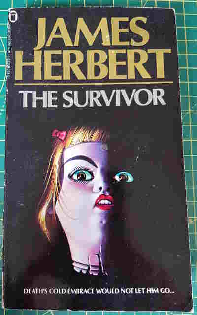

+++
title = "The Survivor"
date = "2023-04-17"
sorted_by = "date"
[taxonomies]
tags=["books"]
contexts=[]
categories=[]
+++

published 1976

verdict: pretty good

- A plane crashes into Eton and the Standard James Herbert Protagonist, who
  mysteriously survived the crash, must work out what happened and whether it
  was his fault.

- Some good horror set-pieces loosely threaded together. I read the book a few
  weeks ago and I can't remember why it was all happening. Something about
  industrial espionage and occultism. I do remember a section where it was
  deemed _impossible_ to bring down a passenger jet these days without it being
  an inside job because of security being impenetrable, which was interesting to
  read in the post-9/11 world.