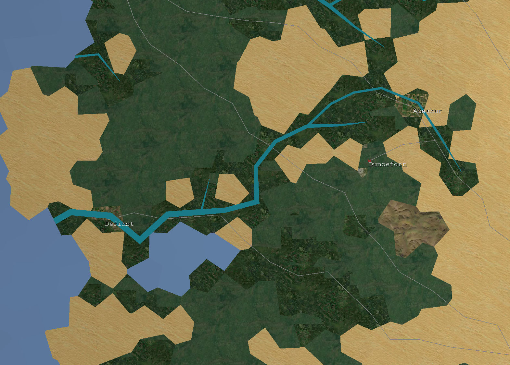

+++
title = "Contingency"
date = "2023-09-15"
sorted_by = "date"
[taxonomies]
tags=["programming", "gamedev", "monogame", "contingency"]
contexts=[]
categories=[]
+++

Things are what they are, but they don't have to be. 

Provision for future eventualities. The absence of certainty.

I've been working on a simulation project in my spare time that I've called
'contingency'. It's early days, and progress is fairly slow. But it's reached a
stage now where I feel I have something to post about. This post will be a bit
of a 'brain dump' of the current state of things, and then I might make further
posts on interesting problems I have encountered.

## Summary

[](./images/screen3.jpg)

Contingency is a map-based game about running an economy, which you will watch
develop over time. The current plan is for the game to play out in real-time,
like a [Paradox][paradox] game, because the game should be a little like a train
set - you should be able to watch things tick along pleasantly, with people
going about their business in various ways. I am hedging my bets a little
though. My thinking is that I can code everything around real time increments
and physical units, and should I wish to go with a turn-based approach I could
make ‘end turn’ run the simulation for a certain length of time. The sorts of
decisions you need to make in the game should not take effect immediately
anyway.

## Points of interest

In no particular order.

<iframe width="560" height="315" src="https://www.youtube.com/embed/Y_lYy0olepk?si=HoxmbyqvFO3qZXJt" title="YouTube video player" frameborder="0" allow="accelerometer; autoplay; clipboard-write; encrypted-media; gyroscope; picture-in-picture; web-share" allowfullscreen></iframe>

### Terrain generation

Approach is based on the excellent [voronoi maps][redblob] page at Red Blob
Games. I intend to revisit it at some point.

### Hydrology

Rainfall is calculated per-tile and based on this rivers flow downhill. The
biggest rivers get drawn.

### Map representation

The map topology is represented as a graph. Arbitrary topologies are supported:
square tiles, hexagonal tiles, or polygonal tiles (as pictured.)  I'll probably
use the hexes for something one day, but for this project the voronoi polygons
seem to give the most pleasing results.

### Land distribution

[](./images/screen4.png)

Land on a tile is subdivided into categories and is measured in square
kilometers. Certain kinds of feature can 'use' land. Entities at a tile with the
LandUse component consume land. Farms use land, and so do Forests. Tile drawing
reflects the land use distribution.

### Name generation

Place, river and person names are generated using a simple Markov Chain word
generator. The generator is fed a corpus of British place names (and river
names, and person names) and spits out (for the most part) uncannily plausible
sounding made-up names. To be honest it could be replaced with a simple list of
names, but this is more fun.

### Data model

Everything lives in [Arch ECS][arch]. It's in early development but is very
simple and fast, and the author is very helpful and friendly. Other such
libraries were either not simple (Svelto) or not fast (Entitas.)

### UI library

The UI is implemented using [Dear ImGUI][imgui], the Only Good UI library.

One day when there is a playable game, I might replace this with a more
'aesthetic' interface, but for now this is perfect as it's easy to work with.

### Social simulation

As well as the coarse-grained economic simulation, I have a fine-grained
'sample' set of individual people. The idea is that eventually the economic
simulation will cause things to happen to them.

### Map drawing

Most work is done in the shader. The same simple mesh (which uses a vertex
attribute to associate vertices with tile ids) can be drawn in various ways.

MonoGame doesn't support passing an arbitrary buffer as input to a shader, so I
encode various tile data as textures and decode that in the fragment shader. It
wouldn't surprise me if this was less efficient than just generating a bigger
mesh on the CPU, but it's certainly fun. I haven't tried to optimise the shader;
the slow thing at the moment is actually calculating the land use to pass to the
shader.

Based on a per-tile land-use vector, the shader splits each tile into a number
of subtiles proportional to the land-use breakdown specified by the vector.

```c
/// @brief A shader that assigns colour based on terrain texture.
float4 TileTerrainTextureWithLandUsePS(VertexShaderOutput input) : COLOR
{
    int TileIndex = int(input.TileId);
    float TileValue = ReadBufferValue(
        TileValuesSampler, TileIndex, TileValuesWidth).r;
    float TileElevation = ReadBufferValue(
        TileElevationsSampler, TileIndex, TileValuesWidth).r;
    int TileTerrainIndex = ReadBufferValueAsInt(
        TileTerrainsSampler, TileIndex, TileValuesWidth);

    // Read land type proportions.
    float proportionForest = 
        ReadLandUseValue(TileIndex, LAND_USE_FOREST);
    float proportionHabitation = 
        ReadLandUseValue(TileIndex, LAND_USE_HABITATION);
    float proportionFarm = 
        ReadLandUseValue(TileIndex, LAND_USE_FARM);
    float proportionBare = 
        ReadLandUseValue(TileIndex, LAND_USE_BARE);
    float proportionMountain = 
        ReadLandUseValue(TileIndex, LAND_USE_MOUNTAIN);

    // Calculate thresholds.
    float maxForest = proportionForest;
    float maxHabitation = maxForest + proportionHabitation;
    float maxFarm = maxHabitation + proportionFarm;
    float maxBare = maxFarm + proportionBare;
    float maxMountain = maxBare + proportionMountain;

    // UV should be roughly in interval 0..1. So map to subtile like
    // so
    int uSubdivs = 3;
    int uvX = int(frac(input.UV.x) * float(uSubdivs));
    int uvY = int(frac(input.UV.y) * float(uSubdivs));
    int uvIndex = uvY * uSubdivs + uvX;

    // Now, based on the land distribution, assign a land use to the
    // subtile.
    int textureIndex = TerrainTextures[TileTerrainIndex];
    float uvDistance = float(uvIndex) / float(uSubdivs * uSubdivs);
    if (uvDistance < maxForest) {
        textureIndex = LandUseTextures[LAND_USE_FOREST];
    } else if (uvDistance < maxHabitation) {
        textureIndex = LandUseTextures[LAND_USE_HABITATION];
    } else if (uvDistance < maxFarm) {
        textureIndex = LandUseTextures[LAND_USE_FARM];
    } else if (uvDistance < maxBare) {
        // Use terrain.
    } else if (uvDistance < maxMountain) {
        textureIndex = LandUseTextures[LAND_USE_MOUNTAIN];
    }

    // Now sample the appropriate terrain texture.
    float2 xy = input.WorldXY;
    float4 TileTerrainColour = SampleTextureAtlas(
        TerrainTextureAtlasSampler,
        TerrainTextureAtlasWidth,
        TerrainTextureAtlasTextureWidth,
        textureIndex,
        xy * TerrainTextureScale);
    float elevationFactor = 0.4;
    float3 baseColour = TileTerrainColour.xyz;
    return float4(baseColour * (1 - elevationFactor) + 
                      baseColour * TileElevation * elevationFactor, 
                  1);
}
```

## What took all this time???

I started working on this some time in late 2021. Much of the early time was
spent learning Unity whilst working on an initial prototype. Throughout 2022 I
worked on this prototype off and on, whilst growing more frustrated with Unity
-- why is serialization so hard? why is there no good user interface library?
Why is it so hard to debug? The list of frustrations went on and on. As an
attempt to alleviate the frustrations, I ended up writing a separate WPF
frontend to the simulation (which I had deliberately structured to be ignoring
of Unity) which was more pleasant to work with than Unity. But then I had the
problem of maintaining two different clients, neither of which was ideal.

By the end of 2022 I decided to bin Unity and use MonoGame -- more of a library
than a game engine -- instead. The straw that broke the camel's back was
attempting to use the Unity profiler, which used all of the memory on my
machine. In a sense it's probably my own fault for attempting to use my 7 year
old computer for development, but at the same time, man got to the moon with
much less!

Switching to MonoGame would allow me to combine the best of the Unity and WPF
integrations into a single program and (eventually!) allow me to make progress
faster. At the same time, I found that my simulation prototype needed some sort
of structured data model. I had deliberately avoided Unity DOTS and GameObject
as I did not want to couple my code to Unity (which is what made it relatively
straightforward to 'port' it to MonoGame) and had followed the philosophy of
'just write some code', which worked well up to a point but became unwieldly
with the introduction of more different kinds of entity, and as I attempted to
make changes to the code. So I experimented with various 'entity component
system' libraries and settled on the very pleasant Arch.

Much of 2023 has been concerned with finishing the MonoGame port. Whilst it's
more pleasant to work with (for me, as a programmer) than Unity, there are
various things you simply have to implement yourself which came 'out of the box'
with Unity, and that takes time. I've also been working on an adventure game,
also using MonoGame, which I might post about at another point, and that took a
few months of work.

Finally, I got a bit bogged down thinking about how to represent land use, and
users of land -- is a Farm an entity on a Tile, or is a component of a Tile?
That kind of thing. I seem to have cracked that one recently though, so now
(fingers crossed) it's time to make a bit more progress.

## Next steps?

- Make rivers look nicer (perhaps animate them)
- Make water look nicer (perhaps animate it)
- Functioning economy
  - At the moment people simply consume food. Goal for the prototype has always
    been to get various commodities circulating in some sort of equilibrium.

[paradox]: https://en.wikipedia.org/wiki/Paradox_Interactive
[imgui]: https://github.com/ocornut/imgui
[redblob]: https://www.redblobgames.com/x/2022-voronoi-maps-tutorial/
[arch]: https://github.com/genaray/Arch