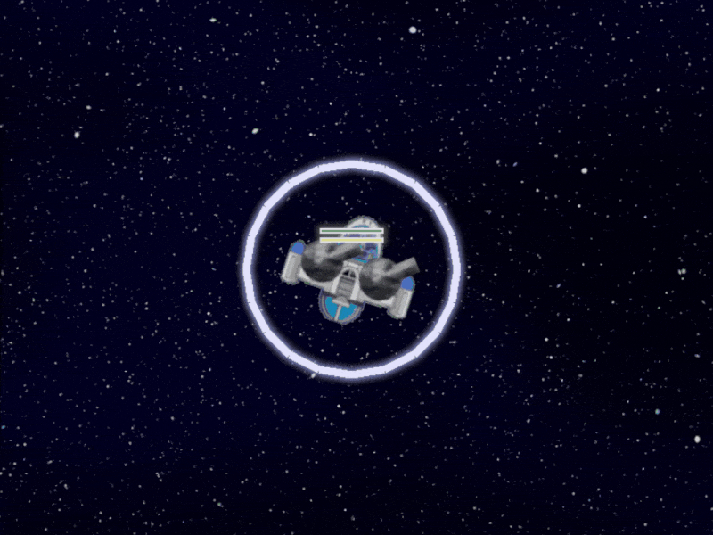

+++
+++

# projects

The following is a selection of _spare time_ projects of mine. Most of my professional
work is on closed-source proprietary software; these repositories are _not wholly_
representative of professional-quality code, although _parts_ of them are probably
up to scratch.

## contingency

Things are what they are, but they don't have to be.

Provision for future eventualities. The absence of certainty.

I've been working on a simulation project in my spare time that I've called 'contingency'.

[info](../posts/20230915-contingency)

## space_game

> ⚠️ **Note:** This has not been maintained for some time and
> will not run unmodified. It is awaiting a weekend or so of 'dusting off'.

[github](https://github.com/nathanrw/space_game)

A space game written in Python. It's currently a very simple arcade space shooter.

### features

- Simple, custom 'entity component system' object model whereby entities are imbued
  with data and behaviours by adding 'components' to them.
- Abstract rendering architecture with software and 'modern' (for the time!) OpenGL renderers.
  - Graphical effects such as bloom.
  - Batching and ordering of draw calls.
  - Aimed at low-end netbook hardware, which is what I wrote it on.
  - Snapshot of a work in progress, as detailed in extensive comments.
- 'nuklear' IMGUI integration.
- 'pymunk' physics engine integration. Physics bodies synced with data model.

## single-header C libraries in Python

[github](https://github.com/nathanrw/single-header-c-libs-in-python) [slides](https://www.nathanrw.dev/single-header-c-libs-in-python/#/)

This is a presentation I did on a technique I used for consuming single header C libraries from Python in a personal project, utilising the hard work of other people so that I did not have to do any!

Given a single-header dependency with no existing binding, you can easily create (and build, and package) one by feeding the header directly to `cffi`, with some simple text transformations to remove problematic syntax.

## nuklear-cffi

> ⚠️ **Note:** This has not been maintained for some time and
> will not run unmodified. It is awaiting a weekend or so of 'dusting off'.

[github](https://github.com/nathanrw/nuklear-cffi)

A semi-automatic Python binding for the nuklear C library.

The core of this is a python program that parses the nuklear.h header for declarations and passes this to the 'cffi' Python binding generator.

Declarations are extracted using a C preprocessor followed by some simple ad hoc text transformations. The 'pcpp' preprocessor is used. This is a C preprocessor written in Python, so the preprocessing step doesn't actually require a C compiler to be installed.

However, the process of generating the Python binding requires a C compiler.

Some code for interfacing nuklear with pygame is provided under pynk.nkpygame.